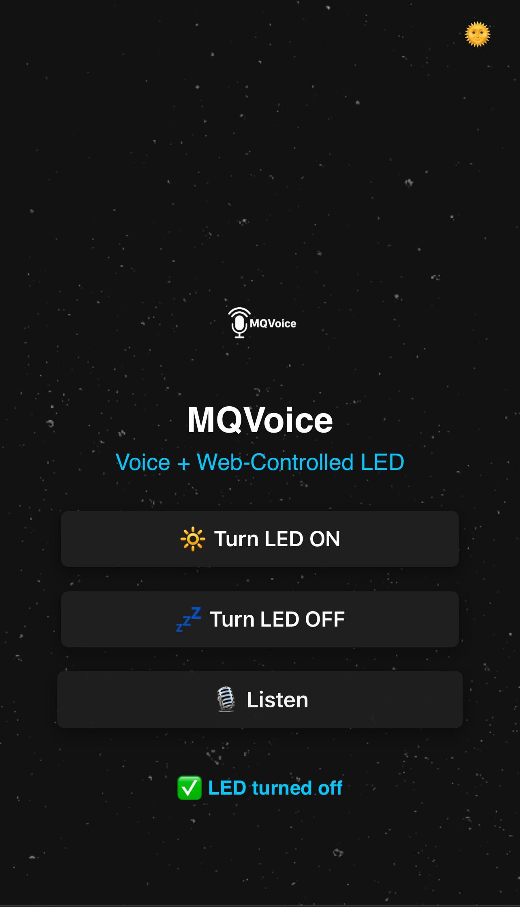
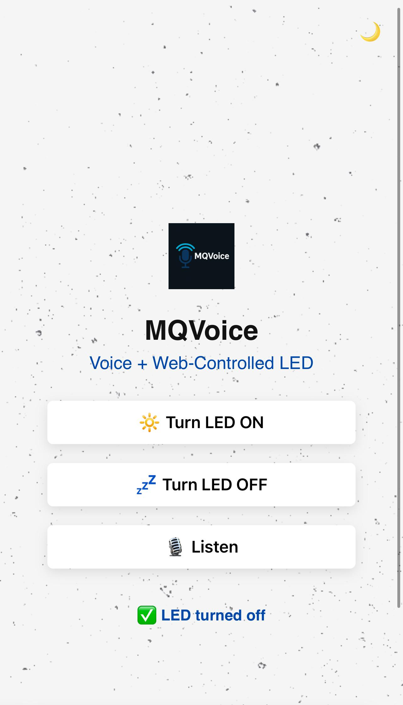
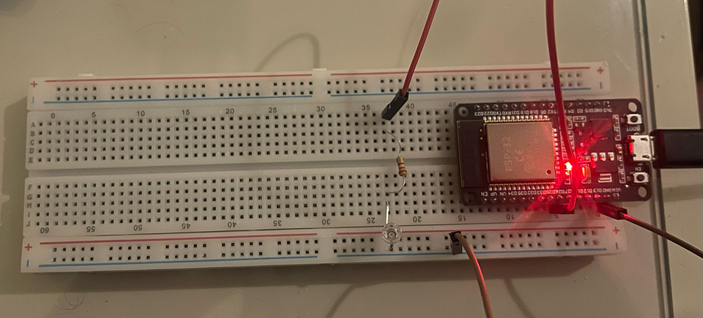

<p align="center">
  
</p>

<h1 align="center">🎙️ MQVoice</h1>

<p align="center">
  <b>MQTT-Powered Voice & Web-Controlled IoT System</b><br/>
  <i>Control LEDs through Web App, Voice Commands & MQTT</i>
</p>

---

## 📽️ Demo & Screenshots

| Web App - Dark Mode | Web App - Light Mode |
|---------------------|----------------------|
|  |  |

| Breadboard Setup |
|------------------|
|  |

| Demo Video |
|------------------|
| 🎬[Click to open demo video](Media/demo-video.mp4) |

---

## 📖 Project Overview

MQVoice is an IoT system that enables **voice-activated** and **web-based** control over devices (e.g., LEDs) using **MQTT protocol**. The system integrates:

- ESP32 microcontroller
- Secure MQTT communication
- Web-based dashboard with dark/light mode
- Voice recognition via browser

### 🔄 Logical Flow

1. **ESP32** reads commands via MQTT topic: `led/control`.
2. **MQTT Broker (EMQX)** securely handles messages using TLS.
3. **Node.js server** (running locally) listens to `/led` endpoint and publishes MQTT messages accordingly.
4. **MQTTX** or any subscriber receives updates from ESP32 (optional feedback).
5. **Ngrok** exposes the local Node.js server securely to the public web.
6. **Frontend Web App** sends HTTP requests to Node.js server to control LED.
7. **Voice Commands** use Web Speech API to interpret "on/off" and trigger the same flow.

---

## 🛠️ Tools & Technologies Used

| Tool / Tech        | Description |
|--------------------|-------------|
| ⚙️ **Arduino IDE**      | Used to program the ESP32 board to connect to Wi-Fi and MQTT broker and control hardware (LED). |
| 🖥️ **Visual Studio Code** | IDE for writing and managing both the backend server (`server.js`) and frontend (`index.html`, CSS, JS). |
| 🌐 **Ngrok**             | Secure tunneling service to expose `localhost` server to public internet for mobile/web access. |
| 🌍 **Node.js + Express** | Backend server to receive HTTP requests and publish MQTT messages. |
| 💬 **MQTT Protocol**     | Lightweight messaging protocol used for communication between ESP32 and backend. |
| 🧠 **MQTTX**             | MQTT GUI client used to test and debug MQTT publish/subscribe flows. |
| 🌩️ **EMQX Cloud**        | Free MQTT broker platform with TLS support for secure device communication. |
| 🎨 **HTML + CSS + JS**   | Frontend technology stack for responsive UI, theme toggle, and voice interaction. |
| 🗣️ **Web Speech API**    | Enables browser-based voice recognition to trigger LED commands via the interface. |

---

## 🧠 Features

- ✅ Voice-controlled LED switching
- ✅ Fully responsive web dashboard
- ✅ Dark & Light themes with logo toggle
- ✅ Works seamlessly on mobile and desktop
- ✅ MQTT-based secure communication
- ✅ Realtime visual feedback in UI
- ✅ TLS-secured broker communication

---

## ⚙️ Setup Instructions

Follow the steps below to run the **MQVoice** project locally with full functionality:

### 🧱 1. Clone the Repository

```bash
git clone https://github.com/MohamedEldairouty/MQVoice.git
cd MQVoice
```

> Make sure the repo includes:  
> 📁 `Arduino Code/`  
> 📁 `Certificates/`  
> 📁 `Web App/Frontend/`  
> 📁 `Web App/Backend/`  
> 📁 `Media/`  

### 🔌 2. ESP32 Setup with Arduino IDE

1. Open **Arduino IDE**.
2. Connect your **ESP32** to the laptop.
3. Open the `.ino` file from the `Arduino Code/` folder.
4. Make sure the following libraries are installed:
   - `WiFiClientSecure`
   - `PubSubClient`
5. Adjust the Wi-Fi credentials and MQTT endpoint in the code if needed.
6. Upload the code to the ESP32.
7. Wire the LED based on `Media/breadboard-setup.jpg`.

### 🖥️ 3. Backend – Node.js Server

1. Open a terminal and navigate to the backend:
   ```bash
   cd Web App/Backend
   ```
2. Install dependencies:
   ```bash
   npm install
   ```
3. Start the backend server:
   ```bash
   node server.js
   ```

### 🌍 4. Expose Your Server using Ngrok

1. In the same Backend folder, open a second terminal and run:
   ```bash
   ngrok http 3000
   ```
2. Ngrok will give you a public HTTPS URL like:  
   `https://abc123.ngrok-free.app`
3. Copy that URL.

### 💻 5. Run the Frontend (Web App)

- Open the Ngrok URL `https://abc123.ngrok-free.app` in your browser (on laptop or mobile).
- The frontend loads directly from the backend's public route.
- The interface allows:
  - 🔆 Turn LED ON  
  - 💤 Turn LED OFF  
  - 🎙️ Voice Command via browser microphone  

> 💡 The design is fully responsive and works beautifully on **mobile** and **desktop**.

### 🔁 6. MQTT Flow Overview

- The **ESP32** publishes messages (like `state=on`) over **MQTT** to the broker.
- The **Node.js server** listens to these messages and controls GPIO pins accordingly.
- The **Web App** interacts with the backend using **HTTP GET requests** (e.g., `/led?state=on`).
- We use:
  - **EMQX** as MQTT broker  
  - **Ngrok** to make backend public  
  - **MQTTX** for debugging topics if needed  

---

## 👥 Team MQVoice Members

| Name                           | Registration No. |
|--------------------------------|------------------|
| [@Mohamed Abdallah Eldairouty](https://github.com/MohamedEldairouty) | 221001719 |
| [@Rimas Emad](https://github.com/rimaseldib)                        | 221001067 |
| Moaz Aly                                                           | 221001970 |

---

## 💬 Final Words

MQVoice is more than just an IoT project — it’s a full-stack integration of hardware, cloud messaging, web technologies, and user experience. Whether via a **click or a command**, you are always in control. 🧠💡🌐

---
